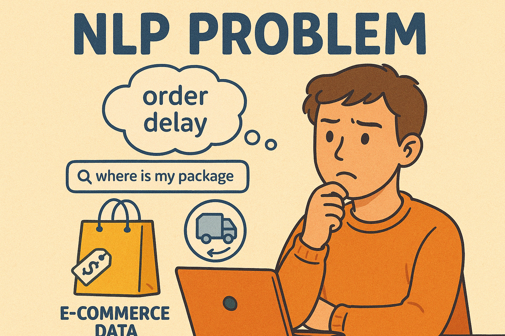
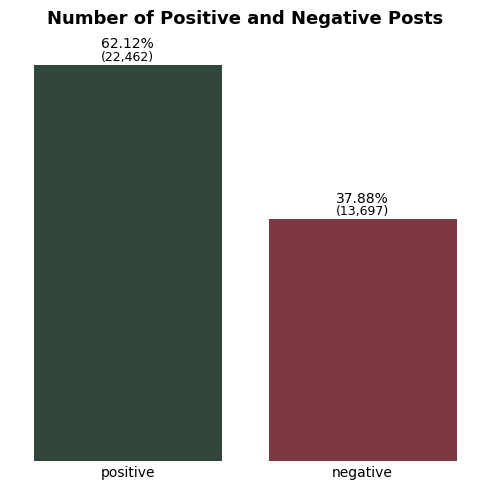
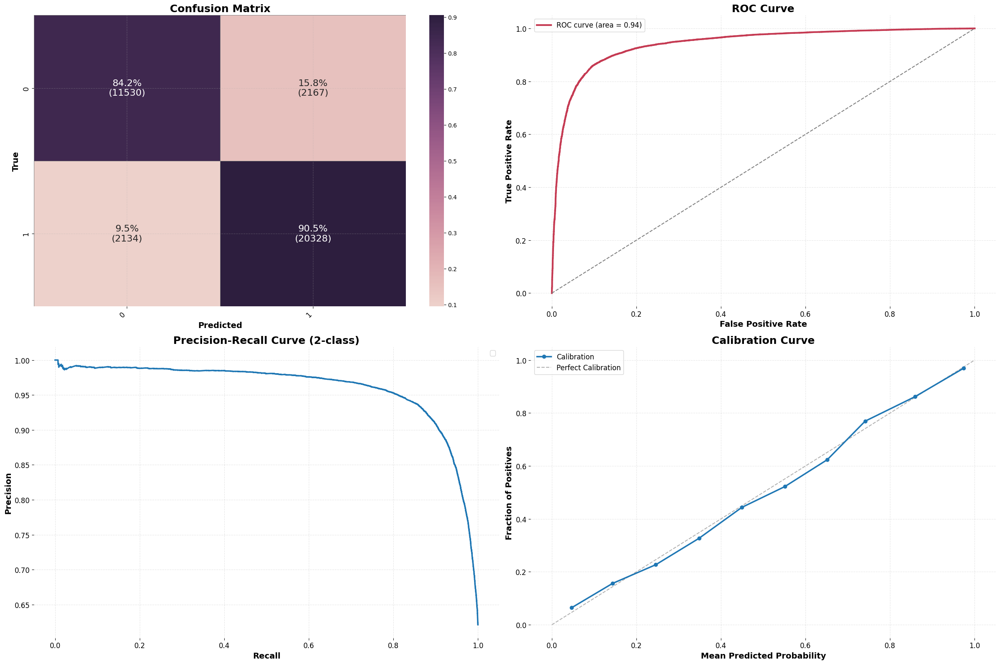
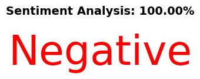
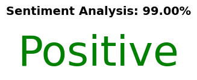
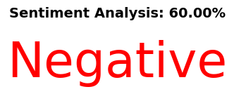
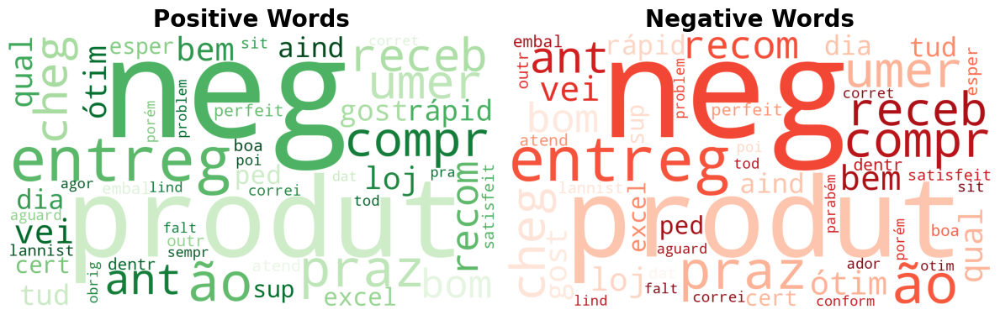

# Sentiment Identification - NLP



## Introduction

The field of Natural Language Processing (NLP) is currently one of the most promising areas within the machine learning landscape. With the widespread adoption of large language models (LLMs) and the advancement of international discussions on the regulation of social media platforms, the task of sentiment analysis has gained prominence and become highly relevant. Having a model capable of classifying the sentiment of a given post can, for instance, prevent harmful content from being disseminated, thereby reducing reputational risks and potential damage to the image of individuals or organizations.

On the other hand, this technique can also be used to detect potential issues or dissatisfaction, serving as a way to assess the “emotional temperature” of customers regarding a brand or service. Within this context, this study will use review data from a Brazilian e-commerce platform, with the aim of performing text preprocessing and training machine learning models capable of identifying two possible sentiments expressed in the analyzed posts.

## Objective

The objective of this study is to **train a machine learning model** to address a **Natural Language Processing (NLP)** problem, using data obtained from a Brazilian e-commerce platform. The primary focus is the development of a **sentiment classification system** based on text data, capable of identifying whether an expressed opinion is **positive, negative, or neutral**.

The project is divided into two main phases:

### Phase 1: Binary Classification (Positive vs. Negative)
In this initial stage, with **well-defined and balanced classes**, it was possible to achieve **excellent performance** in metrics such as **F1-Score** and **AUC (Area Under the ROC Curve)**, indicating a high discriminative capacity between positive and negative sentiments.

### Phase 2: Multiclass Classification (Positive, Negative, and Neutral)
The inclusion of the **neutral** class, which is significantly underrepresented, introduced new challenges to the model, particularly in terms of **probability calibration** and performance on **macro-averaged metrics** and **per-class evaluation**, requiring more refined adjustments to maintain system robustness.

At the conclusion of the study, a **function was developed to identify the sentiment of a given sentence**, returning not only the **predicted label**, but also the **associated confidence score**, thus enhancing the interpretability of the model’s output.

### A/B Experiment

To compare the proposed approaches, this project was structured as an **A/B experiment**, in which the **binary classification model (A)** is compared against the **multiclass model (B)**. The objective of this comparison is to evaluate the **performance gains or losses** resulting from the inclusion of the **neutral class**, analyzing its impact from multiple perspectives, such as:

- **Class distribution**  
  Assessment of class balance and its effect on the training process.

- **Confusion between the neutral class and others**  
  Evaluation of misclassification rates involving the neutral class in contrast to the positive and negative classes.

- **Comparison of macro vs. weighted metrics**  
  Analysis of performance differences when considering class balance (macro) versus class frequency weighting (weighted).

- **Probability calibration**  
  Investigation of the quality of probabilistic estimates for predicted classes in each approach.

This experiment allows not only for performance measurement, but also for a deeper understanding of the **practical implications** of introducing a third class in sentiment analysis problems.


### Repository Structure

The `main.ipynb` notebook contains the core code responsible for executing the analyses conducted on the dataset. All visual assets used in this document are located in the `assets/img/` directory.

The `src/` directory houses the Python scripts developed throughout the analytical process. These scripts implement functions and classes designed to streamline future analyses by promoting code reusability, graphical standardization, and workflow organization. Each file follows a modular structure to minimize code redundancy and maintain the visual consistency adopted across all project visualizations.

The `data/` directory contains the `.csv` file with the dataset used in this project. Finally, the `requirements.txt` file provides a complete list of libraries and dependencies, enabling easy replication of the development environment by other users.


## [Data set](https://www.kaggle.com/datasets/olistbr/brazilian-ecommerce)

The **Brazilian E-Commerce Public Dataset**, made available by Olist, is a comprehensive dataset that documents approximately **100,000 orders placed between 2016 and 2018** across various Brazilian online marketplaces.

This dataset provides a **detailed view of the e-commerce ecosystem in Brazil**, covering information about **customers, sellers, products, payments, deliveries, and customer reviews**. Its richness and diversity make it a valuable resource for analyses in multiple domains, such as consumer behavior, logistics, service quality, and, in this case, **sentiment classification in customer reviews**.


## Methodology and Results

The dataset used in this study contains a wide range of information that enables complex analyses of the Brazilian e-commerce market. However, as the primary focus of this work is to analyze customer reviews, all other data attributes were excluded at this stage. For this purpose, only the `olist_order_reviews_dataset.csv` file was utilized.

From the available data in this file, only two columns were selected: `review_comment_message` and `review_score`. The `review_score` column is a numerical variable ranging from 1 to 5. To simplify the sentiment analysis, a new categorical variable was created, where scores from 1 to 3 were labeled as negative sentiment, and scores 4 and 5 as positive sentiment.

This transformation facilitates a more straightforward analysis of comment polarity. The figure below illustrates the distribution of the two sentiment categories, with 62.12% classified as positive and 37.88% as negative. It is worth noting that, culturally, it is less common for customers to leave unsolicited positive feedback. Conversely, when an issue occurs with an order, the likelihood of posting a negative review increases significantly.




Following a preliminary analysis of the content in selected customer reviews, the **text preprocessing pipeline** described below was developed.

This pipeline consists of four main stages:

1. **Data cleaning**: Removal of line breaks, dates, monetary values, and other elements deemed irrelevant for textual analysis.
2. **Stopword removal**: Elimination of common Portuguese stopwords such as “de,” “para,” “com,” and similar terms that do not contribute meaningful semantic value to the context.
3. **RSLP stemming algorithm**: Application of the RSLP (Removedor de Sufixos da Língua Portuguesa) algorithm to reduce words to their root forms, facilitating lexical normalization.
4. **TF-IDF vectorization**: Conversion of the cleaned text into numerical vectors using the TF-IDF (Term Frequency–Inverse Document Frequency) method, which assigns weights to terms based on their local and global frequency.

This preprocessing pipeline standardizes the textual data, enabling its effective use as input for machine learning algorithms. It enhances the models' ability to detect meaningful patterns and extract relevant insights from textual content.


```python
text_pipeline = Pipeline([
    ('RegexCleanerTransformer', RegexCleanerTransformer(regex_cleaner)),
    ('StopwordRemover', StopwordRemover(pt_stopwords)),
    ('StemmerTransformer', StemmerTransformer(rslp_stemmer)),
    ('TextVectorizer', TextVectorizer(tfidf_vectorizer))
])
```

## Model Training and Evaluation

The model selected for this study was the **XGBClassifier**, chosen for its strong performance when combined with vector representations generated via the **TF-IDF** method.

To enhance model performance, **hyperparameter optimization** was performed using the **Optuna** library in conjunction with **stratified cross-validation (StratifiedKFold)**. This approach aimed to ensure greater robustness and generalization of the optimized parameters. A total of **100 trials** were executed, exploring multiple hyperparameter combinations. For full details of the configuration and execution, refer to the file [`src/tuning/classification_hyper_tuner.py`](https://github.com/rvanguita/Brazilian_E-Commerce/blob/main/src/tuning/classification_hyper_tuner.py).

After applying the best hyperparameter set to the classification pipeline, the results obtained through cross-validation indicated a **solid and balanced performance**, as summarized in the table below:

| Accuracy | Precision | Recall | F1 Score | ROC AUC | Matthews Corrcoef | Cohen Kappa | Brier Score | Log Loss |
|----------|-----------|--------|----------|---------|--------------------|-------------|--------------|----------|
| 88.11%   | 87.38%    | 87.34% | 87.36%   | 94.08%  | 0.75               | 0.75        | 0.09         | 29.93    |

The metrics **Accuracy**, **Precision**, **Recall**, **F1 Score**, and **ROC AUC** indicate efficient classification, with a good balance between **false positives and false negatives**.

Additionally, the **Matthews Correlation Coefficient (MCC)** and **Cohen’s Kappa**, both scoring **0.75**, reinforce the model's robustness — particularly valuable in scenarios with potential class imbalance, as they account for all elements in the **confusion matrix**.

The **Brier Score** of **0.09** shows that the **predicted probabilities are well-calibrated**, i.e., close to the actual observed frequencies. As for the **Log Loss value (29.93)**, although seemingly high, it is important to note that it is **not normalized by the number of samples**. Since cross-validation was applied over the entire dataset, such an accumulated value is expected and **does not compromise the model’s overall performance**.


A seguir, são apresentados: a matriz de confusão, a curva ROC e uma tabela com todas as métricas de avaliação. O treinamento do modelo foi realizado utilizando validação cruzada, a fim de garantir a robustez e a capacidade de generalização dos resultados. Entre as métricas de avaliação, o modelo alcançou uma AUC da curva ROC de 94,10% e um F1 Score de 88,63%, destacando sua eficácia na tarefa de classificação de sentimentos.





With the model trained and the TF-IDF vectorizer fitted, a custom prediction function was developed. This function takes as input a review sentence, along with the trained model, the fitted TF-IDF transformer, and the text preprocessing function. As output, it generates an image displaying the prediction probability and the predicted sentiment (positive or negative).

Below are some example sentences along with the corresponding model predictions:

- **Sentence**: *"Péssimo produto! Não compro nessa loja, a entrega atrasou e custou muito dinheiro!"*  
  

- **Sentence**: *"Adorei e realmente cumpriu as expectativas. Comprei por um valor barato. Maravilhoso."*  
  

- **Sentence**: *"Não sei se gostei do produto. O custo foi barato, mas veio com defeito. Se der sorte, vale a pena."*  
  

The final sentence presents an **ambiguous or neutral tone**, reflecting uncertainty on the part of the customer. Nevertheless, the model was able to correctly interpret the overall context and classify the message as expressing **negative sentiment**, demonstrating sensitivity to the **linguistic nuances** present in the text.

Next, a word cloud is presented for each sentiment class (positive and negative), displaying the most frequently occurring terms. The word size corresponds to the frequency of each term in the analyzed comments, allowing for a quick visual identification of the most representative words in each sentiment category.

  
